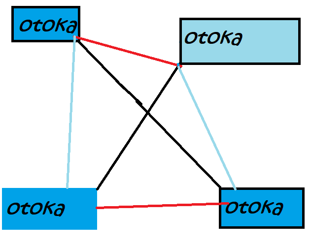

# otoka
<!--In today's world, there are specific individuals, communities, corporations, etc. who are software developers.--  

However, if that is the case, the whereabouts of the software will depend on the developer, and the user will be swayed.  
In order to overcome such a situation, I created software "otoka" that can be freely customized by users and whose developer does not depend on specific individuals, communities, corporations, etc.  
## otoka's "developer"
In the previous section, I said, "It's not good to have a developer."  
However, otoka also has a "developer" (the originator) (I am), and such a situation is very bad.  
Therefore, please feel free to release your otoka code (according to the GPL license).  
You can also introduce it on your home page, etc., and indicate what to write in load.txt.  
## 
--->
<br /><br />
## 1. Guide
otoka is a software written in Python that can eliminate a specific "developer".  　
In order to support the project, there is currently a "developer" in otoka, so please implement otoka in various ways or introduce otoka on your own website.  
### 1.1. Let's start!
#### 1.1.1. install otoka
command(I have verified with wsl2, but I think it will work even if the main OS is linux):  
```
git clone https://github.com/pi-moku/otoka.git
cd otoka
```  
#### 1.1.2. write load.txt
In load.txt, write the URLs and paths you want to load in order from the top.  (Must be written with newline delimiter)  
example(load.txt):  
```
https://pi-moku.github.io/
```  
#### 1.1.3. execution
When executing, execute "python3 otoka.py filename" in the shell. (filename is the file path you want to write)  
example:  
```
python3 otoka.py program.py
```
Then the otoka program reads load.txt, reads the contents of the url and path, and writes them to the specified file.  
(In the example, the contents of https://pi-moku.github.io are written to "program.py".)  
## 2 Error
If you run it and get an error, first check load.txt.  
Are you writing with line breaks?  
Does the url or path you are writing exist?  
(Full path is recommended)  
If it exists after checking, let's check the execution method next.  
Are you specifying arguments?  
If it is still specified, it may be an otoka bug. If it's a bug, please file an issue on this repository.  
## 3.otoka Five philosophies
1,be simple  
2,long live freedom  
3,authoritarianism is bad  
4,Long live the dispersion  
5,All Programmers Should Respect Users.  
## 4. LICENSE
GNU General Public License v3.0  
## 5.NOTE
This was translated from Japanese to English using a translation service.  
So I think there are some grammar mistakes.  
[Click here for Japanese version](JA.md)  
[日本語版はこちら](JA.md)  
